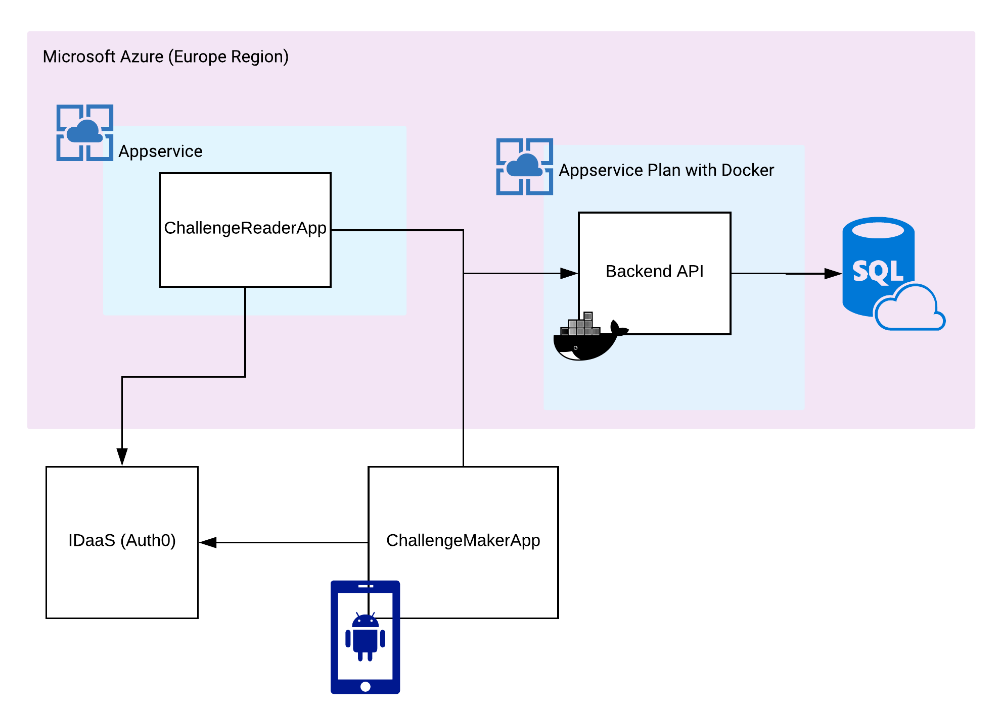

# Green Challenges
This project was developed by team 'Challenge Maker',  under 48 hrs for https://sogeti-greenxgames.bemyapp.com/

## Get the code locally
```
git clone https://github.com/bxav/greenxgames-challenge-maker.git
```

## Deploy everything from your local machine
```bash
./scripts/deploy-from-local.sh
```

## Architecture



## Open source libraries and projects used
* [Ionic](https://api-platform.com/): Used for the ChallengeReader and the android app ChallengeMaker
* [Terraform](https://api-platform.com/): Used to deploy our infrastructure to Azure
* [Api plateform](https://api-platform.com/): Used to build our main Rest api

## Backend Development

### Run on your local
```bash
cd backend
docker-compose up -d
```
### Run Test

```bash
# Run end to end test 
docker-compose exec php bin/behat

```

## Frontend Development

### Run on your local
```bash
cd frontend
npm install
ionic serve
```

## Folder Structure

```bash
.
|scripts/
|...deploy-from-local.sh
|infrastructure/ # Terraform files to deploy everything to azure
```

